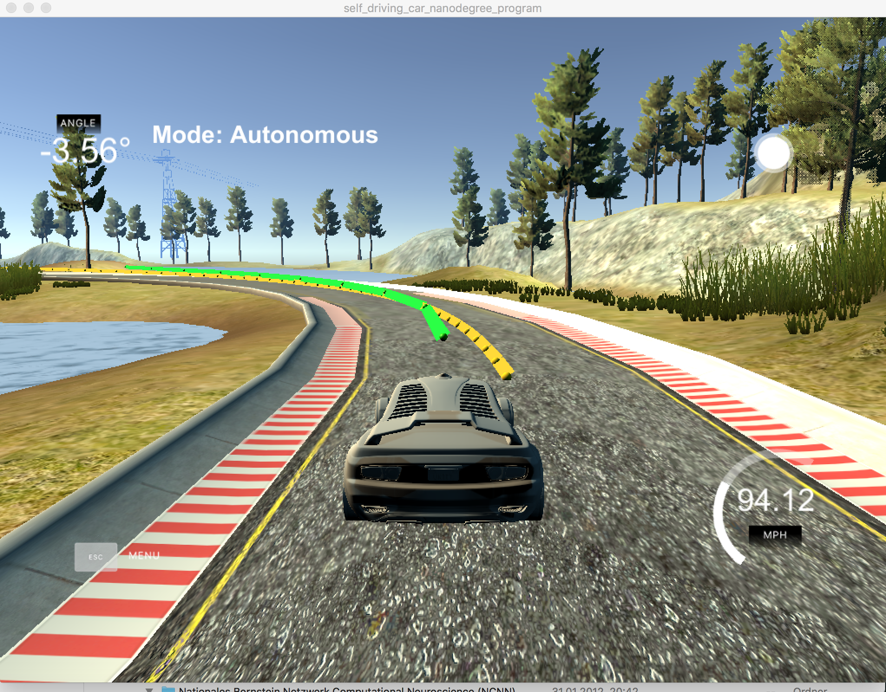
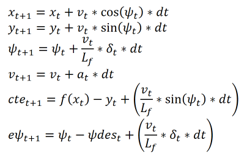

# Udacity Self-Driving Car Enginer Nanodegree
# *CarND-Controls-MPC*

## Introduction

In this project, a vehicle has to be manoevered around a race track in a given simulator. It has to be navigated by a Model Predictive Controller (MPC) taking locations of the reference trajectory and the status of the car as input (e.g. car coordinates, car's orientation, ...) and sending steering of the wheels and throttle as control parameters to the simulator. A 100ms latency of the car's reaction time has to be considered. The car should drive safe around the track.


<p align="center">

</p>


**Results**: *[yellow line: Reference trajectory, green line: Predicted trajectory]*
* Final @ 106MPH MaxSpeed
[YouTube video](https://www.youtube.com/watch?v=nxHeWYgSoag)
* Example with more steady green line (@97MPH MaxSpeed)
[YouTube video](https://www.youtube.com/watch?v=1kj3NrYRL20)


## Model Predictive Control

The idea of Model Predictive Control (MPC) is to follow a trajectory as an optimization problem. The optimization is based upon cost optimization of the model's status parameters and calculating the model's control parameter accordingly. In this project, the Kinematic Model is used. The MPC consists of the following elements:

* #### Predicted trajectory
  The predicted trajectory is defined by the number *`N`* of tracking points and their timing distance *`dt`*

* #### Kinematic Model
  The Kinematic Model consists of the following status parameters:
  * *`x`*, *`y`*: Position of the car
  * *`psi`*: Orientation of the car
  * *`v`*: Velocity of the car
  * *`cte`*: Cross track error
  * *`epsi`*: Orientation error

  and the control parameter:

  * *`delta`*: Steering angle
  * *`a`*: Throttle

  Together, they are building the following mathematical model:
  <p align="left">
  
  </p>

  where Lf is the distance from the front of the vehicle to the center of its gravity and psides[t] is the tangential angle of the function f(x[t]) [*arctan(f'(x[t]))*].     
  All of them have to be applied to each of the predicted trajectory points.

* #### Optimization / Cost Function

  The cost function is the sum (over all predicted trajectory points) of the squares of:

  * *cte[t]*                  `(factor: 500)`
  * *epsi[t]* 	              `(factor: 500)`
  * *v[t]* - *v_ref* 
  * *delta[t]* 
  * *a[t]*
  * *delta[t]* * *v[t]*	      `(factor: 200)`
  * *delta[t+1]* - *delta[t]* `(factor: 25)`
  * *a[t+1]* - *a[t]*

  The later three equations are defined to 'smoothen' the change of steering in accordance to velocity, of steering and of throttle. The factor in parenthesis describes the weight given to the according equation during implementation. No information means that the factor is one.


## Implementation

The implementation consists of the main file `main.cpp` for status preparation, file `MPC.cpp` with the class functions, and file `MPC.h` to define classes for basic settings (`BaseSettings`), for equation preparation (`FG_eval`), and for equation solving (`MPC`).

The status preparation in `main.cpp` consists of reading in the reference points (l.88-89) in map coordinates and the current status parameters of the car (l.90-95). The coordinates of the reference points are transformed into car coordinates (l.97-106) before the coefficients of the fitted reference line (3rd order polynom) and the errors are calculated (l.108-113). To consider the 100ms latency of the vehicle's reaction time, the status values in dt=0.1 seconds are calculated (l.115-125) followed by the MPC call (l.127-129). Afterwards, the calculated steering angle and throttle are prepared for the simulator (l.132-141) with the information collection for the green line (predicted course, l.143-153) and for the yellow line (reference course, l.155-165).

To collect the basic settings (*N*, *dt*, *Lf*, *ref_v*, ...) at one location, an additional class `BaseSettings` is defined in `MPC.h`. It is inherited to the classes `FG_eval` and `MPC`. The values chosen are *N*=10 and *dt*=0.1. They showed the fastest adoptation. Other variants, like *N*=20, *dt*=0.05 or *N*=20, *dt*=0.1, showed no improvement or worsened the simulation experience.

The file `MPC.cpp` contains the functions for preparation (`FG_eval::operator()`) and solving (`MPC::Solv`) of the Model Predictive Control equations. The preparation consists of defining the cost functions (l.15-37) and calculation of the vehicle's status for each of the *N* time points of the predicted trajectory. Especially introducing the cost of steering change in accordance to velocity and the weighting of the equations led to the good final results. The equation solving is done by defining the upper and lower limits for the control (*delta*:[-25, 25], *a*: [-1, 1]) and status parameters (l.98-148), preparing the equations (l.151) and calling an appropriate function of the `CppAD` and `IPOPT` packages to mathematically solve them (l.153-177). The resulting new steering angle and new throttle are given back with location information of the predicted track points (l.186-194).

The described implementation and parameter setup leads to a maximum speed of ~107 MPH with a very steady and safe driving. Setting the reference velocity from the chosen value of 120 MPH to higher values doesn't increase the maximum speed. This means that the maximum speed of the given simulator has been reached as during lower speeds and under unoptimized settings the vehicle got faster but unsafe in driving.


---

# **Original Udacity README**

## Dependencies

* cmake >= 3.5
 * All OSes: [click here for installation instructions](https://cmake.org/install/)
* make >= 4.1(mac, linux), 3.81(Windows)
  * Linux: make is installed by default on most Linux distros
  * Mac: [install Xcode command line tools to get make](https://developer.apple.com/xcode/features/)
  * Windows: [Click here for installation instructions](http://gnuwin32.sourceforge.net/packages/make.htm)
* gcc/g++ >= 5.4
  * Linux: gcc / g++ is installed by default on most Linux distros
  * Mac: same deal as make - [install Xcode command line tools]((https://developer.apple.com/xcode/features/)
  * Windows: recommend using [MinGW](http://www.mingw.org/)
* [uWebSockets](https://github.com/uWebSockets/uWebSockets)
  * Run either `install-mac.sh` or `install-ubuntu.sh`.
  * If you install from source, checkout to commit `e94b6e1`, i.e.
    ```
    git clone https://github.com/uWebSockets/uWebSockets
    cd uWebSockets
    git checkout e94b6e1
    ```
    Some function signatures have changed in v0.14.x. See [this PR](https://github.com/udacity/CarND-MPC-Project/pull/3) for more details.

* **Ipopt and CppAD:** Please refer to [this document](https://github.com/udacity/CarND-MPC-Project/blob/master/install_Ipopt_CppAD.md) for installation instructions.
* [Eigen](http://eigen.tuxfamily.org/index.php?title=Main_Page). This is already part of the repo so you shouldn't have to worry about it.
* Simulator. You can download these from the [releases tab](https://github.com/udacity/self-driving-car-sim/releases).
* Not a dependency but read the [DATA.md](./DATA.md) for a description of the data sent back from the simulator.


## Basic Build Instructions

1. Clone this repo.
2. Make a build directory: `mkdir build && cd build`
3. Compile: `cmake .. && make`
4. Run it: `./mpc`.

## Tips

1. It's recommended to test the MPC on basic examples to see if your implementation behaves as desired. One possible example
is the vehicle starting offset of a straight line (reference). If the MPC implementation is correct, after some number of timesteps
(not too many) it should find and track the reference line.
2. The `lake_track_waypoints.csv` file has the waypoints of the lake track. You could use this to fit polynomials and points and see of how well your model tracks curve. NOTE: This file might be not completely in sync with the simulator so your solution should NOT depend on it.
3. For visualization this C++ [matplotlib wrapper](https://github.com/lava/matplotlib-cpp) could be helpful.)
4.  Tips for setting up your environment are available [here](https://classroom.udacity.com/nanodegrees/nd013/parts/40f38239-66b6-46ec-ae68-03afd8a601c8/modules/0949fca6-b379-42af-a919-ee50aa304e6a/lessons/f758c44c-5e40-4e01-93b5-1a82aa4e044f/concepts/23d376c7-0195-4276-bdf0-e02f1f3c665d)
5. **VM Latency:** Some students have reported differences in behavior using VM's ostensibly a result of latency.  Please let us know if issues arise as a result of a VM environment.

## Editor Settings

We've purposefully kept editor configuration files out of this repo in order to
keep it as simple and environment agnostic as possible. However, we recommend
using the following settings:

* indent using spaces
* set tab width to 2 spaces (keeps the matrices in source code aligned)

## Code Style

Please (do your best to) stick to [Google's C++ style guide](https://google.github.io/styleguide/cppguide.html).

## Project Instructions and Rubric

Note: regardless of the changes you make, your project must be buildable using
cmake and make!

More information is only accessible by people who are already enrolled in Term 2
of CarND. If you are enrolled, see [the project page](https://classroom.udacity.com/nanodegrees/nd013/parts/40f38239-66b6-46ec-ae68-03afd8a601c8/modules/f1820894-8322-4bb3-81aa-b26b3c6dcbaf/lessons/b1ff3be0-c904-438e-aad3-2b5379f0e0c3/concepts/1a2255a0-e23c-44cf-8d41-39b8a3c8264a)
for instructions and the project rubric.

## Hints!

* You don't have to follow this directory structure, but if you do, your work
  will span all of the .cpp files here. Keep an eye out for TODOs.

## Call for IDE Profiles Pull Requests

Help your fellow students!

We decided to create Makefiles with cmake to keep this project as platform
agnostic as possible. Similarly, we omitted IDE profiles in order to we ensure
that students don't feel pressured to use one IDE or another.

However! I'd love to help people get up and running with their IDEs of choice.
If you've created a profile for an IDE that you think other students would
appreciate, we'd love to have you add the requisite profile files and
instructions to ide_profiles/. For example if you wanted to add a VS Code
profile, you'd add:

* /ide_profiles/vscode/.vscode
* /ide_profiles/vscode/README.md

The README should explain what the profile does, how to take advantage of it,
and how to install it.

Frankly, I've never been involved in a project with multiple IDE profiles
before. I believe the best way to handle this would be to keep them out of the
repo root to avoid clutter. My expectation is that most profiles will include
instructions to copy files to a new location to get picked up by the IDE, but
that's just a guess.

One last note here: regardless of the IDE used, every submitted project must
still be compilable with cmake and make./

## How to write a README
A well written README file can enhance your project and portfolio.  Develop your abilities to create professional README files by completing [this free course](https://www.udacity.com/course/writing-readmes--ud777).
